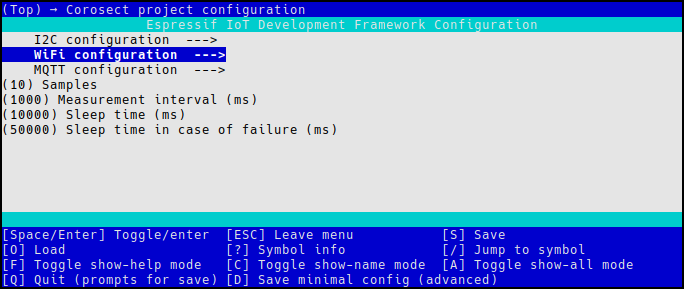

# Build instructions
Get ESP-IDF from [here](https://docs.espressif.com/projects/esp-idf/en/latest/esp32c3/get-started/index.html#ide) following the instructions for your preferred operating system and tool(s).

## Build instructions for GNU/Linux.

First, make sure [environment variables are set](https://docs.espressif.com/projects/esp-idf/en/latest/esp32c3/get-started/linux-macos-setup.html#get-started-set-up-env)

Set target board to `esp32c3` with 
```
idf.py set-target esp32c3
```

### Run to configure
```
idf.py menuconfig
```
Project related configuration can be found under `Corosect project configuration --->`



#### Configure at least the following:
```
Corosect project configuration ---> WiFi configuration ---> WiFi SSID
Corosect project configuration ---> MQTT configuration ---> MQTT Broker URI
```
Optional configuration for I2C can be found under `Corosect project configuration ---> I2C configuration`, by default the program will use GPIO 6 for SDA and GPIO 7 for SCL with a master clock frequency of 1MHz.

### Build with
```
idf.py build            # build
idf.py -p PORT flash    # build and flash board.
```

#### Open serial monitor
```
idf.py -p PORT monitor          # open serial monitor
idf.py -p PORT flash monitor    # build, flash board and open serial monitor
```
`Ctrl + ]` to exit the serial console.

